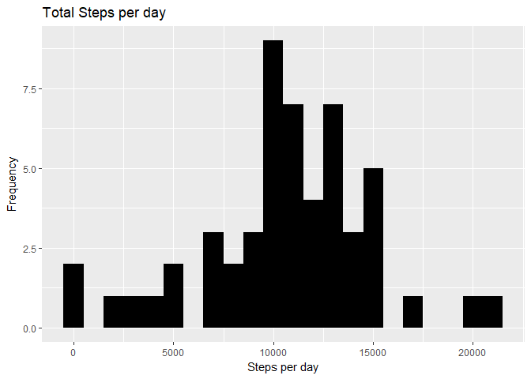
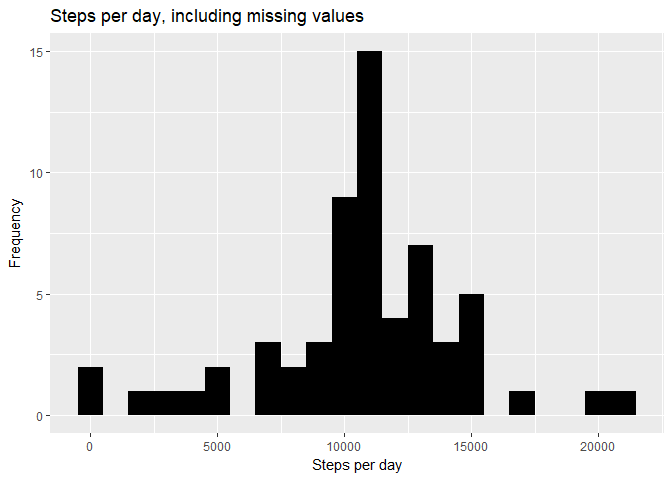

Reproducable Research Course Project 1
======================================

Load the necessary packages and set default of echo to true
-----------------------------------------------------------

    library(knitr)
    opts_chunk$set(echo = TRUE)
    library(dplyr)

    ## 
    ## Attaching package: 'dplyr'

    ## The following objects are masked from 'package:stats':
    ## 
    ##     filter, lag

    ## The following objects are masked from 'package:base':
    ## 
    ##     intersect, setdiff, setequal, union

    library(lubridate)

    ## 
    ## Attaching package: 'lubridate'

    ## The following object is masked from 'package:base':
    ## 
    ##     date

    library(ggplot2)

Loading and preprocessing the data
----------------------------------

### Read the Data

    if(!file.exists('activity.csv'))
      {
      unzip('activity.zip')
      }
    data <- read.csv("activity.csv", header = TRUE, sep = ',', colClasses = c("numeric", "character", "integer"))

### Process the Data

    data$date <- ymd(data$date)

What is mean total number of steps taken per day?
-------------------------------------------------

### 1. Calculate the total number of steps taken per day

    steps <- data %>%
      filter(!is.na(steps)) %>%
      group_by(date) %>%
      summarize(steps = sum(steps)) %>%
      print

    ## # A tibble: 53 x 2
    ##          date steps
    ##        <date> <dbl>
    ##  1 2012-10-02   126
    ##  2 2012-10-03 11352
    ##  3 2012-10-04 12116
    ##  4 2012-10-05 13294
    ##  5 2012-10-06 15420
    ##  6 2012-10-07 11015
    ##  7 2012-10-09 12811
    ##  8 2012-10-10  9900
    ##  9 2012-10-11 10304
    ## 10 2012-10-12 17382
    ## # ... with 43 more rows

### 2. Make a histogram of the total number of steps taken each day

    ggplot(steps, aes(x = steps)) +
      geom_histogram(fill = "black", binwidth = 1000) +
      labs(title = "Total Steps per day", x = "Steps per day", y = "Frequency")

### 3. Calculate and report the mean and median of the total number of steps taken per day

    mean_steps <- mean(steps$steps, na.rm = TRUE)
    median_steps <- median(steps$steps, na.rm = TRUE)

    mean_steps

    ## [1] 10766.19

    median_steps

    ## [1] 10765

What is the average daily activity pattern?
-------------------------------------------

### 1. Make a time series plot (i.e. type = "l") of the 5-minute interval (x-axis) and the average number of steps taken, averaged across all days (y-axis)

    interval <- data %>%
      filter(!is.na(steps)) %>%
      group_by(interval) %>%
      summarize(steps = mean(steps))

    ggplot(interval, aes(x=interval, y=steps)) +
      geom_line(color = "black")

### 2. Which 5-minute interval, on average across all the days in the dataset, contains the maximum number of steps?

    highestSteps <- interval[which.max(interval$steps),]
    print(highestSteps)

    ## # A tibble: 1 x 2
    ##   interval    steps
    ##      <int>    <dbl>
    ## 1      835 206.1698

Imputing missing values
-----------------------

### 1. Calculate and report the total number of missing values in the dataset (i.e. the total number of rows with NAs)

    nbrMissingValues <- sum(is.na(data$steps))
    print(nbrMissingValues)

    ## [1] 2304

### 2. Devise a strategy for filling in all of the missing values in the dataset.

### 3. Create a new dataset that is equal to the original dataset but with the missing data filled in.

    data_full <- data
    nas <- is.na(data_full$steps)
    avg_interval <- tapply(data_full$steps, data_full$interval, mean, na.rm=TRUE, simplify=TRUE)
    data_full$steps[nas] <- avg_interval[as.character(data_full$interval[nas])]

### 4. Make a histogram of the total number of steps taken each day

    steps_full <- data_full %>%
      filter(!is.na(steps)) %>%
      group_by(date) %>%
      summarize(steps = sum(steps)) %>%
      print

    ## # A tibble: 61 x 2
    ##          date    steps
    ##        <date>    <dbl>
    ##  1 2012-10-01 10766.19
    ##  2 2012-10-02   126.00
    ##  3 2012-10-03 11352.00
    ##  4 2012-10-04 12116.00
    ##  5 2012-10-05 13294.00
    ##  6 2012-10-06 15420.00
    ##  7 2012-10-07 11015.00
    ##  8 2012-10-08 10766.19
    ##  9 2012-10-09 12811.00
    ## 10 2012-10-10  9900.00
    ## # ... with 51 more rows

    ggplot(steps_full, aes(x = steps)) +
      geom_histogram(fill = "black", binwidth = 1000) +
      labs(title = "Steps per day, including missing values", x = "Steps per day", y = "Frequency")

### Calculate and report the mean and median total number of steps taken per day

    mean_steps_full <- mean(steps_full$steps, na.rm = TRUE)
    median_steps_full <- median(steps_full$steps, na.rm = TRUE)

    mean_steps_full

    ## [1] 10766.19

    median_steps_full

    ## [1] 10766.19

Are there differences in activity patterns between weekdays and weekends?
-------------------------------------------------------------------------

### 1. Create a new factor variable in the dataset with two levels – “weekday” and “weekend” indicating whether a given date is a weekday or weekend day.

    data_full <- mutate(data_full, weektype = ifelse(weekdays(data_full$date) == "Saturday" | weekdays(data_full$date) == "Sunday", "weekend", "weekday"))
    data_full$weektype <- as.factor(data_full$weektype)
    head(data_full)

    ##       steps       date interval weektype
    ## 1 1.7169811 2012-10-01        0  weekday
    ## 2 0.3396226 2012-10-01        5  weekday
    ## 3 0.1320755 2012-10-01       10  weekday
    ## 4 0.1509434 2012-10-01       15  weekday
    ## 5 0.0754717 2012-10-01       20  weekday
    ## 6 2.0943396 2012-10-01       25  weekday

### Make a panel plot containing a time series plot

    interval_full <- data_full %>%
      group_by(interval, weektype) %>%
      summarise(steps = mean(steps))
    s <- ggplot(interval_full, aes(x=interval, y=steps, color = weektype)) +
      geom_line() +
      facet_wrap(~weektype, ncol = 1, nrow=2)
    print(s)

